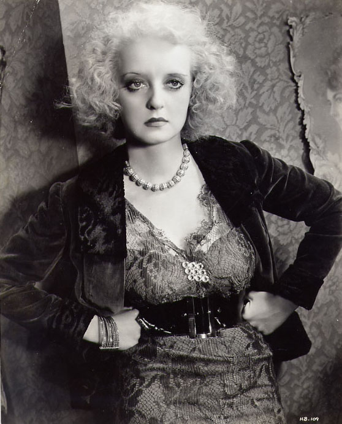

<div align="center">



<br />

*"Attempt the impossible in order to improve your work."*

</div>

---

### Hi, I'm Bree

VP Product. AI-native PM. I build tools that make product managers dangerous.

### **[Bette](https://github.com/breethomas/bette)** — a Claude Code plugin

59 skills. 7 agents. 30 frameworks. One install.

Just tell it what you need. It figures out the rest.

```
/plugin marketplace add breethomas/bette
/plugin install bette@breethomas
```

Design deep dives: [architect](https://github.com/breethomas/bette-architect) · [think](https://github.com/breethomas/bette-think) · [work](https://github.com/breethomas/bette-work) · [operate](https://github.com/breethomas/bette-os)

---

I think PMs should build things, not just spec them.

*Fasten your seatbelts.*
